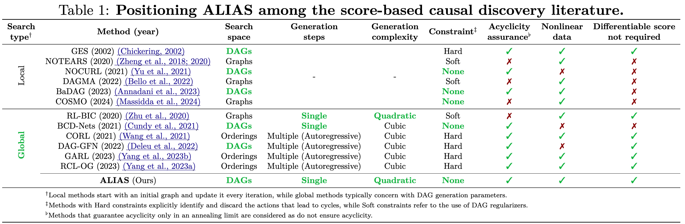
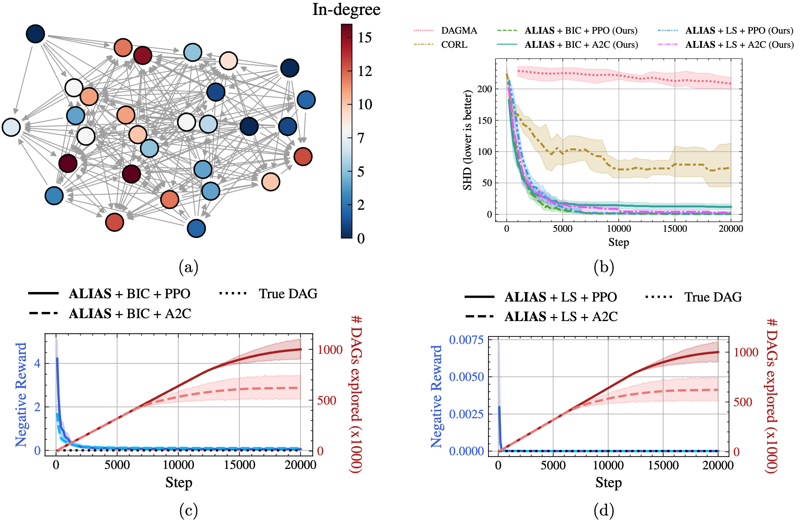
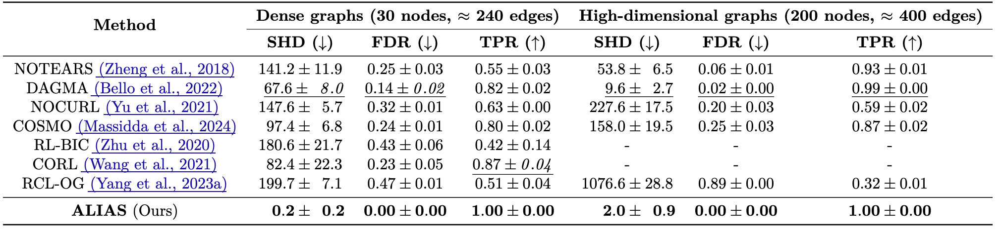

# Reinforcement Learning for Causal Discovery without Acyclicity Constraints

This is an official implementation for our work [Reinforcement Learning for Causal Discovery without Acyclicity Constraints](https://openreview.net/forum?id=sNzBi8rZTy), published in Transactions of Machine Learning Research (TMLR) 2025.

## Abstract
Recently, reinforcement learning (RL) has proved a promising alternative for conventional local heuristics in score-based approaches to learning directed acyclic causal graphs (DAGs) from observational data. However, the intricate acyclicity constraint still challenges the efficient exploration of the vast space of DAGs in existing methods. In this study, we introduce **ALIAS**  (reinforced dAg Learning wIthout Acyclicity conStraints), a novel approach to causal discovery powered by the RL machinery. Our method features an efficient policy for generating DAGs in just a single step with an optimal quadratic complexity, fueled by a novel parametrization of DAGs that directly translates a continuous space to the space of all DAGs, bypassing the need for explicitly enforcing acyclicity constraints. This approach enables us to navigate the search space more effectively by utilizing policy gradient methods and established scoring functions. In addition, we provide compelling empirical evidence for the strong performance of ALIAS  in comparison with state-of-the-arts in causal discovery over increasingly difficult experiment conditions on both synthetic and real datasets.

## Key results

The proposed **ALIAS** method can optimize a given DAG scoring function over the exact DAGs space. This is done by navigating in an unconstrained space, in which each point is directly mapped to a DAG with a one-step operator that can be evaluated optimally, which conveniently absorbs the acyclicity constraint.



By combining a one-step DAG generation policy with policy gradient, we obtain a very accurate score-based causal discovery algorithm. The one-step policy helps ensure the exactness of the search space, while policy gradient enables exploration & exploitation for better searching. This is shown by the continuously increasing number of unique DAGs explored during the search process, which is strongly correlated with the reward (DAG score).



Even in situations known to be challenging to previous approaches, such as dense or large graphs, our method can still achieve near-perfect performance.



## Project structure
```bash
├── data                                    # Put nonlinear GP data and Sachs data here
│
├── alias                                   # implementation of ALIAS
│   ├── ALIAS.py
│   ├── DAGEnv.py
│   ├── DAGScore.py
│   └── VecDAGEnv.py
│
├── utils
│   ├── dag_pruners.py                      # defines pruning methods, e.g., by linear weight, CAM pruning, CIT pruning
│   ├── datagen.py                          # defines data simulations
│   └── metrics.py                          # defines performance metrics
│
├── demo.ipynb                              # Demo notebook
├── run_experiment.py                       # Entry point to run experiments
├── analyzers.py                            # result analyzers for different experiment, is called automatically in run_experiment.py
│
├── configs                                 # configurations for ALIAS and experiments
│   ├── ALIAS_default.yml                   # default hyperparameters, which can be updated with hyperparameters in each specific experiment
│   ├── linear.yml                          # "Small to moderate graphs with linear-Gaussian data" experiment (Figure 2)
│   ├── dense.yml                           # "Dense graphs" experiment (Table 2)
│   ├── large.yml                           # "High-dimensional graphs" experiment (Table 2)
│   ├── different_noises.yml                # "Noise misspecification" experiment (Table 3)
│   ├── different_samplesizes.yml           # "Different sample sizes" experiment (Figure 3, Table 14 & 15)
│   ├── nonlinear_gp.yml                    # "Nonlinear data with Gaussian processes" experiment (Table 4)
│   ├── sachs.yml                           # "Real-world Sachs dataset" experiment (Table 5)
│   ├── runtime.yml                         # "Runtime" experiment (Figure 4b)
│   ├── different_lr.yml                    # "Learning rate" ablation study (Table 16)
│   ├── different_ent.yml                   # "Entropy weight" ablation study (Table 17)
│   ├── noisy.yml                           # "Noisy data" experiment (Table 20)
│   ├── confounder.yml                      # "Hidden counfounder" experiment (Table 21)
│   └── nonlinear_mlp.yml                   # "Nonlinear data with MLPs" experiment (Table 22)
│
├── CAM_1.0.tar.gz                          # R package of CAM: https://cran.r-project.org/src/contrib/Archive/CAM/CAM_1.0.tar.gz
├── setup_CAM.py                            # CAM setup code from gCastle: https://github.com/huawei-noah/trustworthyAI/blob/master/research/Causal%20Discovery%20with%20RL/setup_CAM.py
├── README.md
└── environment.yml                         # Conda environment
```

## Setup

```bash
conda env create -n alias --file environment.yml
conda activate alias
python setup_CAM.py
```

## Running demo

Run [demo.ipynb](demo.ipynb)

## Running experiments

```bash
python run_experiment.py <experiment name>
```

Replace `<experiment name>` with the name of the experiment exactly as in `./configs` (excluding the `.yml` extension).

For example:
```bash
python run_experiment.py linear
```

For nonlinear experiments with GP, download this [dataset](https://github.com/kurowasan/GraN-DAG/blob/master/data/data_p10_e40_n1000_GP.zip) from GraN-DAG's repo then extract it to `./data` before running the experiment.

## Citation

Please consider citing us as follows if you find our work beneficial:

```
@article{
    duong2025reinforcement,
    title={Reinforcement Learning for Causal Discovery without Acyclicity Constraints},
    author={Bao Duong and Hung Le and Biwei Huang and Thin Nguyen},
    journal={Transactions on Machine Learning Research},
    year={2025},
}
```